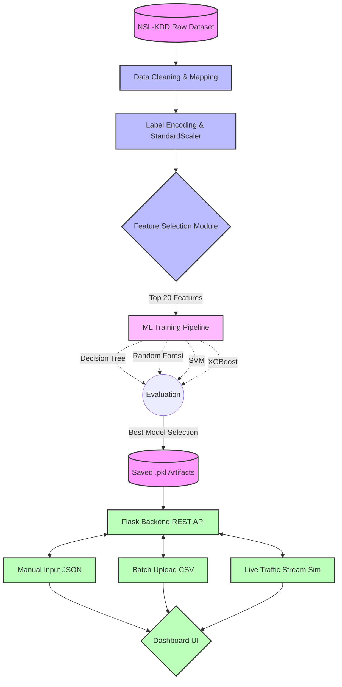
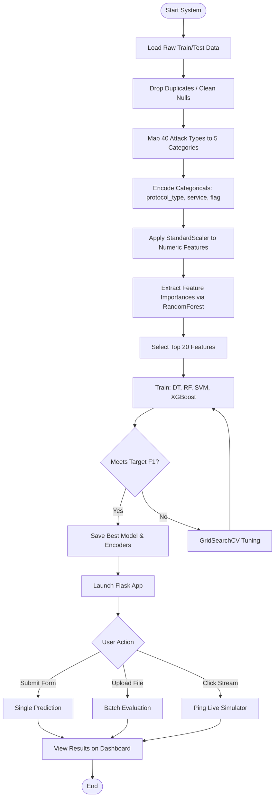
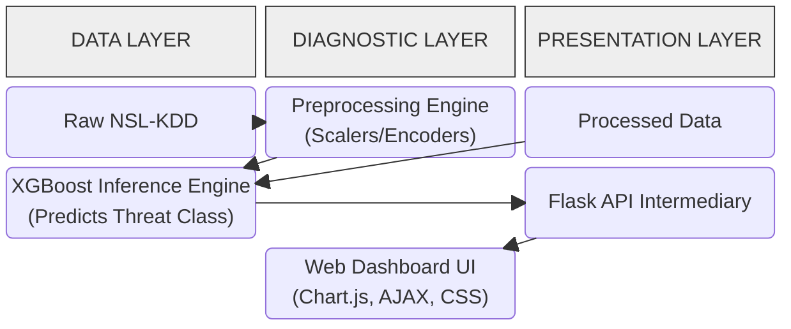

# AI-Based IDS Diagrams

Below are the Mermaid definitions for the System Architecture, Flowchart, and Block diagrams required for the project documentation. You can render these directly in tools that support Mermaid (like GitHub, Notion, or Mermaid Live Editor).

## 1. System Architecture Diagram

## 2. Process Flowchart

## 3. High-Level Block Diagram

